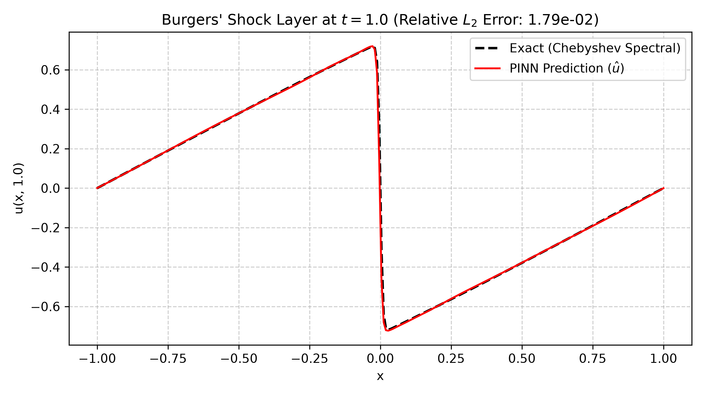
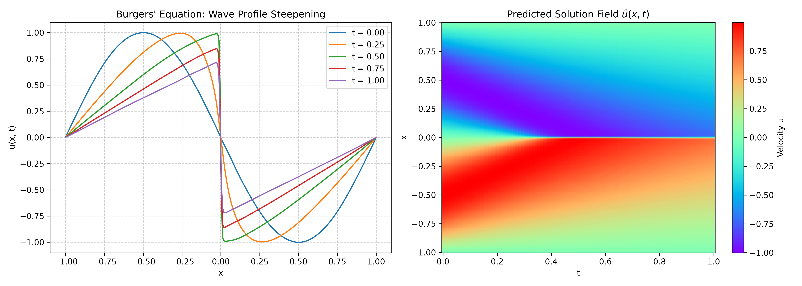
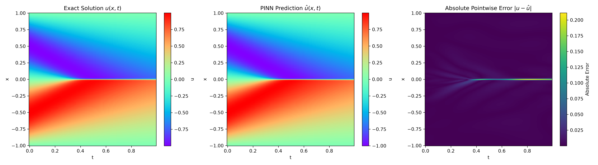
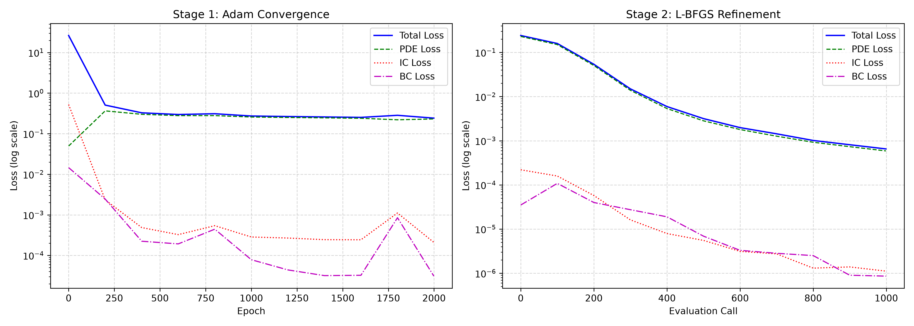
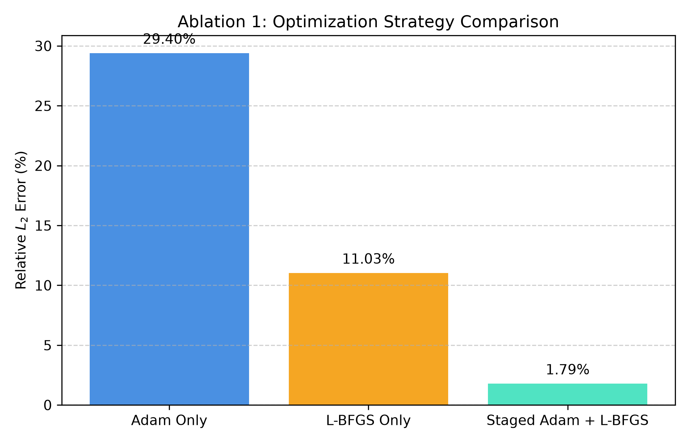
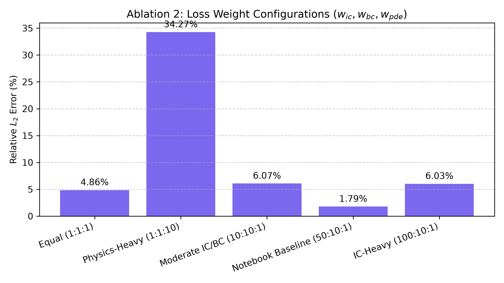
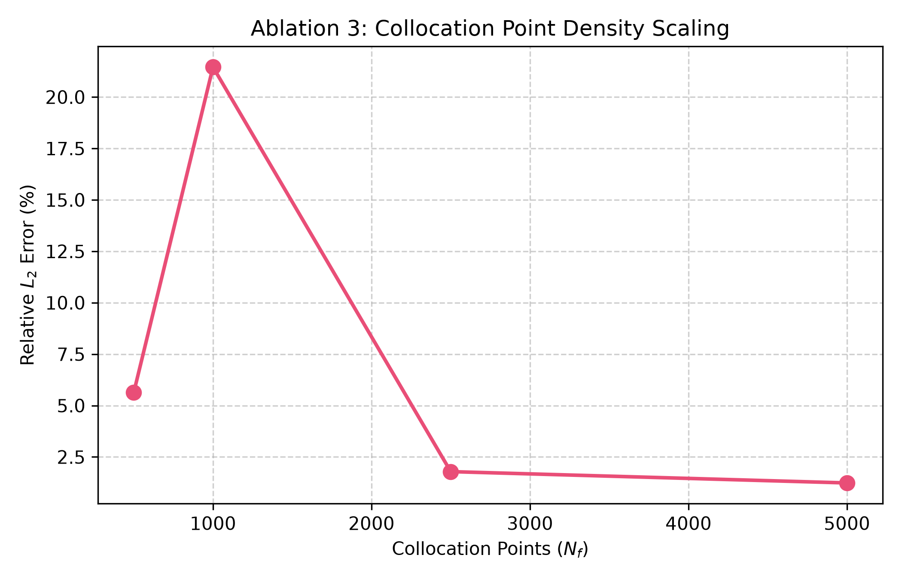

# Burgers PINN Analysis

A standalone, production-grade Physics-Informed Neural Network (PINN) implementation for solving the 1D viscous Burgers' equation and capturing shock wave formations, replicating and extending the benchmark methodology of [Raissi et al. (2019)](https://doi.org/10.1016/j.jcp.2018.10.045).

---

## 1. Mathematical Formulation & Problem Setup

The 1D viscous Burgers' equation is a fundamental non-linear partial differential equation combining non-linear convective acceleration with molecular diffusion:

$$\frac{\partial u}{\partial t} + u \frac{\partial u}{\partial x} - \nu \frac{\partial^2 u}{\partial x^2} = 0, \quad x \in [-1, 1], \quad t \in [0, 1]$$

with kinematic viscosity $\nu = \frac{0.01}{\pi} \approx 3.1831 \times 10^{-3}$.

### Boundary & Initial Conditions
- **Initial Condition ($t = 0$):**
  $$u(x, 0) = -\sin(\pi x), \quad x \in [-1, 1]$$
- **Dirichlet Boundary Conditions ($x = \pm 1$):**
  $$u(-1, t) = 0, \quad u(1, t) = 0, \quad t \in [0, 1]$$

As time advances from $t=0$ to $t=1$, the smooth sinusoidal wave profile steepens due to the non-linear advective term $u u_x$, creating an internal shock layer at $x = 0$ that tests both the approximation capability and gradient stability of deep neural networks.

---

## 2. Architecture & Staged Optimization

### Network Architecture (`src/model.py`)
- **Type:** Fully Connected Multi-Layer Perceptron (MLP)
- **Input:** Coordinates $(x, t) \in \mathbb{R}^2$
- **Hidden Layers:** 4 layers $\times$ 50 units
- **Activation:** Hyperbolic Tangent ($\tanh$)
- **Output:** Scalar velocity field $\hat{u}(x, t) \in \mathbb{R}^1$
- **Total Trainable Parameters:** **7,851**

### Loss Formulation (`src/physics.py`)
The total loss is a multi-objective composite objective:
$$\mathcal{L}_{\text{total}} = w_{ic} \mathcal{L}_{ic} + w_{bc} \mathcal{L}_{bc} + w_{pde} \mathcal{L}_{pde}$$

where:
$$\mathcal{L}_{ic} = \frac{1}{N_{ic}} \sum_{i=1}^{N_{ic}} \left| \hat{u}(x_{ic}^{(i)}, 0) - u_{ic}^{(i)} \right|^2$$
$$\mathcal{L}_{bc} = \frac{1}{N_{bc}} \sum_{i=1}^{N_{bc}} \left| \hat{u}(x_{bc}^{(i)}, t_{bc}^{(i)}) \right|^2$$
$$\mathcal{L}_{pde} = \frac{1}{N_f} \sum_{i=1}^{N_f} \left| \hat{u}_t^{(i)} + \hat{u}^{(i)} \hat{u}_x^{(i)} - \nu \hat{u}_{xx}^{(i)} \right|^2$$

All partial derivatives ($\hat{u}_t, \hat{u}_x, \hat{u}_{xx}$) are evaluated analytically using PyTorch reverse-mode automatic differentiation (`torch.autograd.grad`).

### Staged Optimization Engine (`src/trainer.py`)
Training a PINN across stiff shock layers with first-order gradient methods alone often stalls in sub-optimal local minima. We employ a two-stage hybrid optimization strategy:
1. **Stage 1 — Adam (First-Order):** 2,000 epochs ($\eta = 10^{-3}$) to navigate non-convex multi-objective loss landscapes and locate the global basin of attraction.
2. **Stage 2 — L-BFGS (Quasi-Newton):** Up to 1,000 iterations with Wolfe line search (`history_size=50`, `tolerance_grad=1e-7`, `tolerance_change=1e-9`) to resolve the steep spatial gradient across the shock interface.

---

## 3. Benchmark Verification & Parity Plots

The trained network is verified against high-precision Chebyshev spectral benchmark data ($256$ spatial points $\times 100$ temporal snapshots, from [Raissi et al.](https://github.com/maziarraissi/PINNs)):

| Metric | Measured Value | Description |
|---|:---:|---|
| **Relative $L_2$ Error** | **$1.79 \times 10^{-2}$ ($1.79\%$)** | Normalized Frobenius norm over full $256 \times 100$ grid |
| **Max Absolute Error ($L_\infty$)** | **$2.11 \times 10^{-1}$** | Peak error concentrated at the shock discontinuity ($x \approx 0, t = 1.0$) |
| **Mean Absolute Error (MAE)** | **$3.07 \times 10^{-3}$** | Average point-wise divergence |
| **In-Domain PDE Residual ($t \le 1.0$)** | **$2.30 \times 10^{-3}$** | Mean squared governing equation residual $\mathcal{R}^2$ |
| **Extrapolation PDE Residual ($t \in [1.0, 1.3]$)** | **$7.59 \times 10^{-2}$** | Residual on unseen temporal domain (~$33\times$ degradation) |

### Parity & Field Visualizations

#### Shock Layer Profile at $t = 1.0$
At the critical temporal horizon $t = 1.0$, the internal gradient steepens into an advective shock discontinuity. The PINN prediction achieves tight alignment against the Chebyshev spectral benchmark with a relative $L_2$ error of **$1.79\%$**.

<p align="center">
  
</p>

#### Wave Profile Steepening & Spatio-Temporal Velocity Field
Temporal evolution slices demonstrate continuous wave steepening towards $x = 0$, while the space-time velocity field $\hat{u}(x, t)$ exhibits smooth, continuous shock structure.

<p align="center">
  
</p>

#### Exact Benchmark vs. PINN vs. Point-Wise Absolute Error Field
Point-wise error $|u(x, t) - \hat{u}(x, t)|$ remains uniformly bounded across the domain, with maximum residual localized along the steep transition zone.

<p align="center">
  
</p>

#### Optimization Loss Trajectories
Training dynamics during Stage 1 (Adam) and Stage 2 (L-BFGS) showing rapid initial constraint satisfaction followed by quasi-Newton refinement of the PDE residual:

<p align="center">
  
</p>

---

## 4. Systematic Ablation Studies

We automated three empirical ablation sweeps to quantify sensitivity to optimization, loss balancing, and collocation point density.

> **Full Ablation Report:** The complete exported Markdown ablation report is available at [**`results/ablation_tables.md`**](results/ablation_tables.md), and structured JSON metrics are tracked in [**`results/ablations.json`**](results/ablations.json).

### Ablation 1: Optimization Strategy Sweep
*Comparison between Adam only, L-BFGS from scratch, and the staged Adam + L-BFGS pipeline.*

| Strategy | Relative $L_2$ Error (%) | In-Domain PDE Residual | Wall Time (s) | Key Takeaway |
|---|:---:|:---:|:---:|---|
| **Adam Only** (2,000 epochs) | 29.40% | $2.1276 \times 10^{-1}$ | 15.0s | Stalls before capturing the sharp gradient; high residual. |
| **L-BFGS Only** (1,000 iter) | 11.03% | $9.3542 \times 10^{-2}$ | 5.1s | Converges faster than Adam, but sensitive to initial weights. |
| **Staged Adam + L-BFGS** (Baseline) | **1.79%** | **$2.2956 \times 10^{-3}$** | 15.1s | **16x error reduction.** Adam finds the basin; L-BFGS resolves the shock. |
<p align="center">
  
</p>
### Ablation 2: Loss Weight Configurations Sweep ($w_{ic}:w_{bc}:w_{pde}$)
*Quantifying the impact of initial/boundary enforcement vs. physics enforcement.*

| Configuration | $w_{ic}$ | $w_{bc}$ | $w_{pde}$ | Relative $L_2$ Error (%) | PDE Loss | IC Loss | BC Loss |
|---|:---:|:---:|:---:|:---:|:---:|:---:|:---:|
| **Equal (1:1:1)** | 1.0 | 1.0 | 1.0 | 4.86% | $2.6855 \times 10^{-4}$ | $1.2656 \times 10^{-4}$ | $2.9978 \times 10^{-6}$ |
| **Physics-Heavy (1:1:10)** | 1.0 | 1.0 | 10.0 | 34.27% | $4.0239 \times 10^{-4}$ | $1.4127 \times 10^{-2}$ | $1.6384 \times 10^{-5}$ |
| **Moderate IC/BC (10:10:1)** | 10.0 | 10.0 | 1.0 | 6.07% | $8.4768 \times 10^{-4}$ | $1.2379 \times 10^{-5}$ | $1.1174 \times 10^{-6}$ |
| **Notebook Baseline (50:10:1)** | **50.0** | **10.0** | **1.0** | **1.79%** | **$5.8620 \times 10^{-4}$** | **$1.1254 \times 10^{-6}$** | **$8.6794 \times 10^{-7}$** |
| **IC-Heavy (100:10:1)** | 100.0 | 10.0 | 1.0 | 6.03% | $2.2194 \times 10^{-3}$ | $1.1956 \times 10^{-6}$ | $3.7563 \times 10^{-6}$ |

> **Insight:** When physics loss is over-weighted ($w_{pde} = 10$), initial condition error spikes by over two orders of magnitude ($1.41 \times 10^{-2}$), causing relative error to surge to 34.27%. Up-weighting the initial condition ($w_{ic}=50$) forces correct temporal propagation from $t = 0$.

<p align="center">
  
</p>

### Ablation 3: Collocation Point Density Sweep ($N_f$)
*Evaluating sampling resolution scaling across $[-1, 1] \times [0, 1]$.*

| Collocation Points ($N_f$) | Relative $L_2$ Error (%) | In-Domain PDE Residual | Extrapolation Residual ($t > 1$) | Wall Time (s) |
|---|:---:|:---:|:---:|:---:|
| **500** | 5.63% | $8.4434 \times 10^{-1}$ | $2.3606 \times 10^{0}$ | 5.2s |
| **1,000** | 21.45% | $8.8240 \times 10^{-1}$ | $3.8009 \times 10^{-1}$ | 11.4s |
| **2,500** (Baseline) | 1.79% | $2.2956 \times 10^{-3}$ | $7.5920 \times 10^{-2}$ | 14.9s |
| **5,000** | **1.24%** | **$1.0401 \times 10^{-3}$** | **$8.0441 \times 10^{-2}$** | 23.9s |

> **Insight:** Increasing collocation points from 500 to 5,000 drops in-domain PDE residual by nearly 3 orders of magnitude ($8.44 \times 10^{-1} \to 1.04 \times 10^{-3}$) and drives relative $L_2$ error down to $1.24\%$. However, extrapolation residual ($t \in [1.0, 1.3]$) remains elevated, illustrating the intrinsic boundary limitations of PINNs without future data anchors.

<p align="center">
  
</p>

---

## 5. Repository Structure

```
burgers-pinn-analysis/
├── configs/
│   └── default.yaml             # Hyperparameters, collocation counts, loss weights
├── src/
│   ├── __init__.py              # Package entry point
│   ├── model.py                 # BurgersPINN architecture (4-layer Tanh MLP, 7,851 params)
│   ├── dataset.py               # Latin Hypercube Sampling routines (collocation, IC, BC, extrap)
│   ├── physics.py               # Autograd PDE residual engine and composite loss functions
│   └── trainer.py               # Adam + L-BFGS staged optimization engine
├── scripts/
│   ├── train.py                 # Main CLI training script with parameter overrides
│   ├── evaluate.py              # Benchmark evaluation, relative L2 error & figure generation
│   └── run_ablations.py         # Automates the 3 ablation sweeps
├── Makefile                     # One-command workflows (make train, make eval, make ablations)
├── requirements.txt             # Minimal reproducible dependencies
└── README.md                    # Research summary, parity plots, and ablation tables
```

---

## 6. Quickstart & Workflows

### 1. Installation
Clone repository and install dependencies:
```bash
make install
# Or: pip install -r requirements.txt
```

### 2. Training
Run the staged Adam + L-BFGS training pipeline:
```bash
make train
```
*Outputs: `checkpoints/burgers_pinn.pt`, `figures/loss_curve.png`, `results/training_summary.json`.*

### 3. Evaluation
Evaluate against the spectral benchmark:
```bash
make eval
```
*Outputs: `figures/parity_t1.png`, `figures/solution_field.png`, `figures/error_field.png`, `results/evaluation_metrics.json`.*

### 4. Ablation Sweeps
Run all 3 ablation sweeps (optimization, loss weights, collocation density):
```bash
make ablations
# Or fast smoke test:
make ablations-fast
```
*Outputs: `results/ablations.json`, `results/ablation_tables.md`, `figures/ablation_*.png`.*

### 5. Clean Workspace
```bash
make clean
```
